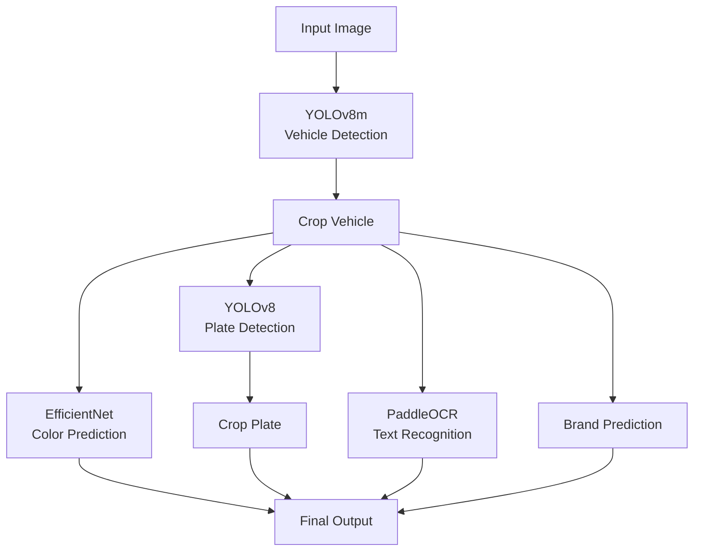

# 🚗 AI Vision Project


A modular **computer vision pipeline** for car understanding, including vehicle detection, color classification, brand recognition, license plate detection, and OCR.

---

## 🧠 Architecture Overview



---
## Project Structure

- **assets/local-statices/**
- **input/** — input images for testing
- **models/** — model configs + pretrained weights (download externally)
- **notebooks/** — experiments, training notebooks
- **outputs/** — pipeline outputs (created with run)
- **src/pipelines/** — core pipeline modules:
  - `brand_predict.py` — vehicle brand prediction
  - `color_predict.py` — vehicle color prediction
  - `ocr.py` — license plate OCR
  - `plate_crop.py` — crop license plates
  - `vehicle_detect.py` — detect vehicles
- **requirements_tensorflow.txt** — TensorFlow dependencies (first virtual environment)
- **requirements_paddle.txt** — Paddle dependencies (second virtual environment)
- **run_pipeline.py** — main script to run the pipeline

---

## ⚙️ Installation

### 1. Clone repo
```bash
git clone https://github.com/abdalmjeedalshami/ai-doroob
cd ai-doroob
```

### 2. Create environments inside `venvs/`
```bash
mkdir venvs
python -m venv venvs/venv_tf
python -m venv venvs/venv_paddle
```

### 3. Install dependencies

**TensorFlow**
```bash
source venvs/venv_tf/bin/activate
pip install -r requirements_tensorflow.txt
source venns/venv_tensorflow/bin/deactivate
```

**Paddle**
```bash
source venvs/venv_paddle/bin/activate
pip install -r requirements_paddle.txt
source venvs/venv_paddle/bin/deactivate
```

---

## 🚨 Important Notes

- **Do NOT mix environments**
- Always activate the correct virtual environment before installing packages
- Do not upload `venvs/` or large outputs to GitHub

---

## 🤖 Models

### ✅ Pretrained models (currently used)
The project requires the following pretrained model weights. <b>These are not included in the repository</b> and must be downloaded from <b>Google Drive</b>:

[**Download Pretrained Models**](https://drive.google.com/drive/folders/1Kx7fkI68of8oPhWpgpJ6HVY1ez3ZUASm?usp=drive_link)

After downloading, replace the `models/` folder. The pipeline will automatically use them.

- `yolov8m.pt` → vehicle detection
- `license_plate_detector.pt` → license plate detection

---

### 🚘 Car Brand Model

- Architecture: **ResNet18 (pretrained=True)**
- Fully trainable and reproducible

To retrain or recreate:

➡️ Run the notebook inside:
```
src/training/training-brand-model/notebook.ipynb
```

Requirements:
- Dataset must be inside the same folder
- Follow the included README in that directory

---

## ▶️ Usage

Run the full pipeline:

```bash
python run_pipeline.py
```

Put your test images inside:
```
input/
```

---

## 🧰 Tools

- Python 3.9+
- TensorFlow / Paddle
- YOLOv8
- PaddleOCR
- Jupyter Notebook
- VS Code / PyCharm

---

## 📬 Contact

GitHub:
https://github.com/abdalmjeedalshami/ai-doroob
